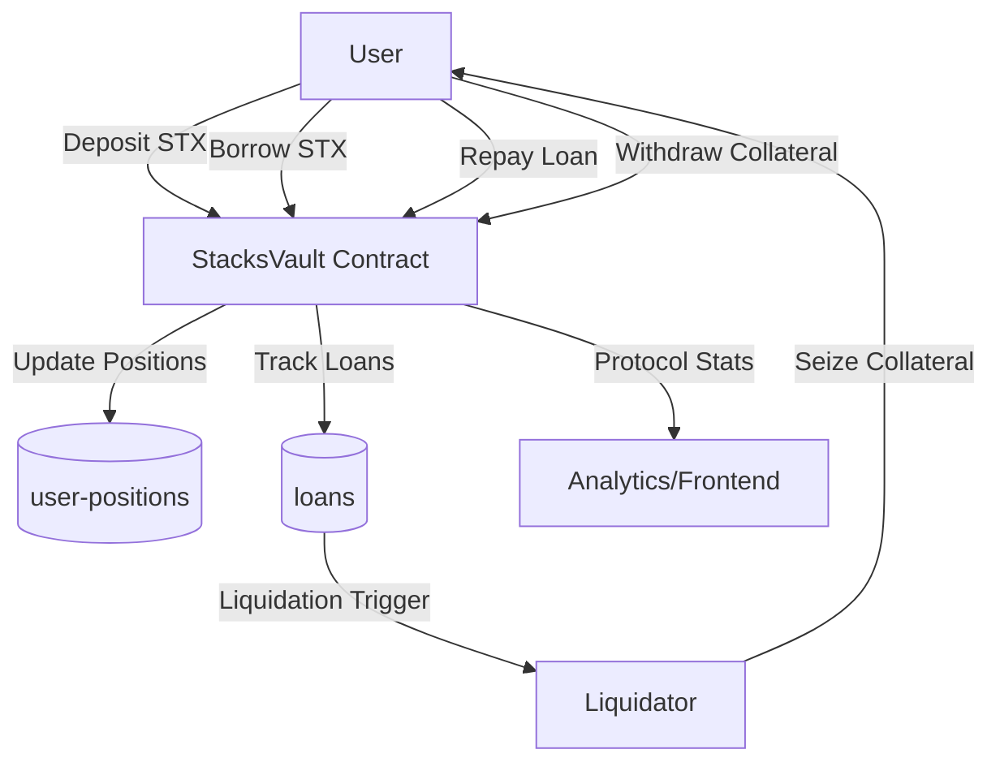

# 📖 StacksVault Protocol

**Bitcoin Layer 2 Decentralized Lending & Borrowing Infrastructure**

StacksVault is an institutional-grade decentralized finance (DeFi) protocol built on **Stacks Layer 2**, enabling secure lending, borrowing, and yield generation using **STX as collateral**. By leveraging Bitcoin’s security and Stacks’ smart contract capabilities, StacksVault delivers a **transparent, trust-minimized, and capital-efficient lending marketplace**.

---

## 🚀 System Overview

StacksVault allows users to:

* **Deposit STX as collateral** to unlock borrowing capacity.
* **Borrow STX** while maintaining safe overcollateralization ratios.
* **Repay loans** at any time to reduce debt obligations.
* **Withdraw collateral** while maintaining collateralization requirements.
* **Participate in liquidations**, ensuring protocol solvency by closing undercollateralized positions.

### Core Principles

* **Don’t sell your Bitcoin, borrow against it** – extended to the entire Stacks ecosystem.
* **Full on-chain transparency** – all positions, ratios, and protocol parameters are verifiable.
* **Automated risk management** – liquidation engine protects solvency and depositors.
* **Configurable governance** – protocol constants and parameters can be adjusted responsibly.

---

## 🏛 Contract Architecture

The protocol is implemented as a **single Clarity smart contract** with modular components:

### **1. Protocol State**

* **Global Variables**: Track total deposits, total borrows, collateral ratios, liquidation thresholds, and protocol fees.
* **Constants**: Enforce safe bounds (e.g., max/min collateral ratio, protocol fee caps).

### **2. Storage Maps**

* **`loans`**: Individual loan records with collateral, debt, interest rate, and activity status.
* **`user-positions`**: Aggregated collateral and borrow data per user.

### **3. Core Logic**

* **Collateral Management**: Deposit/withdraw STX with collateralization checks.
* **Borrowing & Repayment**: Borrow against collateral, repay loans with interest accrual.
* **Liquidation Engine**: Automatically close positions falling below safety thresholds.
* **Interest Calculation**: Compound interest based on block height progression.

### **4. Governance Functions**

* Adjust minimum collateral ratio.
* Update liquidation threshold.
* Configure protocol fee.

---

## 🔄 Data Flow

Below is a simplified flow of how users and the protocol interact:



---

## 📦 Core Functions

### User Functions

* **`deposit`** → Deposit STX as collateral.
* **`borrow(amount)`** → Borrow STX against collateral.
* **`repay(amount)`** → Repay borrowed STX.
* **`withdraw(amount)`** → Withdraw collateral (if safe).
* **`liquidate(user)`** → Liquidate undercollateralized positions.

### Read-Only Functions

* **`get-user-position(user)`** → Retrieve collateral, borrow, and loan count.
* **`get-protocol-stats`** → Protocol-wide metrics for analytics.

### Governance/Admin Functions

* **`set-minimum-collateral-ratio(new-ratio)`**
* **`set-liquidation-threshold(new-threshold)`**
* **`set-protocol-fee(new-fee)`**

---

## ⚖️ Risk Management

* **Collateral Ratios**: Borrowing only permitted if collateralization ratio ≥ minimum threshold.
* **Liquidations**: Triggered automatically once ratio < liquidation threshold.
* **Protocol Caps**: Prevent unsafe governance changes (max fees, ratio bounds).

---

## 📊 Protocol Parameters (Defaults)

| Parameter                | Default | Description                   |
| ------------------------ | ------- | ----------------------------- |
| Minimum Collateral Ratio | 150%    | Safe borrowing threshold      |
| Liquidation Threshold    | 130%    | Trigger for liquidations      |
| Protocol Fee             | 1%      | Applied to loan interest/fees |
| Max Collateral Ratio     | 500%    | Governance safety bound       |
| Max Protocol Fee         | 10%     | Governance safety bound       |

---

## 🔐 Security Considerations

* All funds are handled by smart contracts, **non-custodial**.
* Liquidation incentives protect solvency against undercollateralized loans.
* Protocol parameters are bounded to prevent misconfiguration.
* Auditing and rigorous testing recommended prior to mainnet deployment.

---

## 📈 Future Extensions

* Support for multi-asset collateral (BTC, stablecoins).
* Advanced interest rate models (dynamic based on utilization).
* Vault tokenization for composability across Bitcoin DeFi.
* Integration with decentralized price oracles.

---

## 🛠 Development

This contract is written in **Clarity** and deployable on **Stacks Layer 2**.

### Requirements

* [Stacks CLI](https://docs.stacks.co/build-tools/cli)
* [Clarity tools](https://github.com/hirosystems/clarity-repl)

### Local Testing

```bash
clarinet test
```

---

## 📜 License

StacksVault Protocol is released under the **MIT License**.
